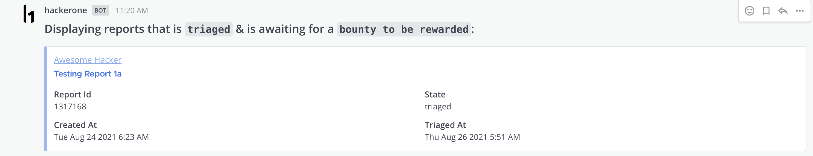
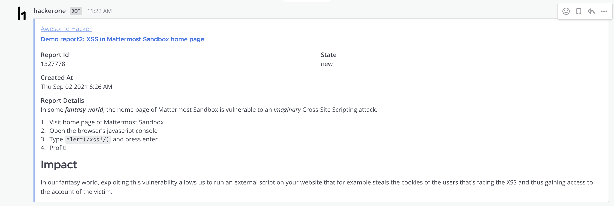
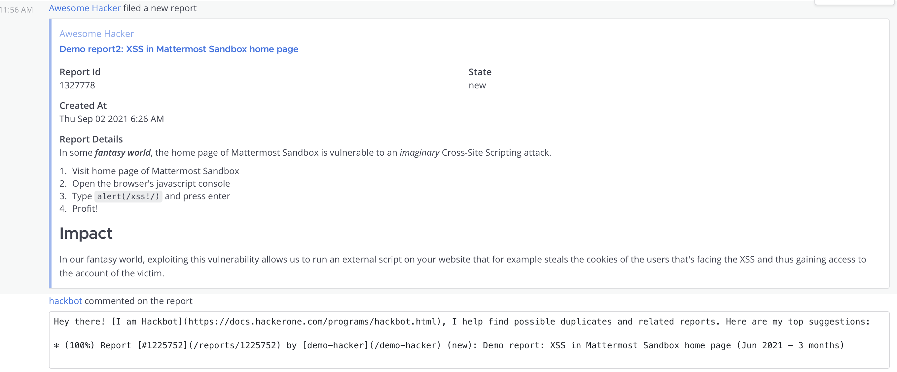
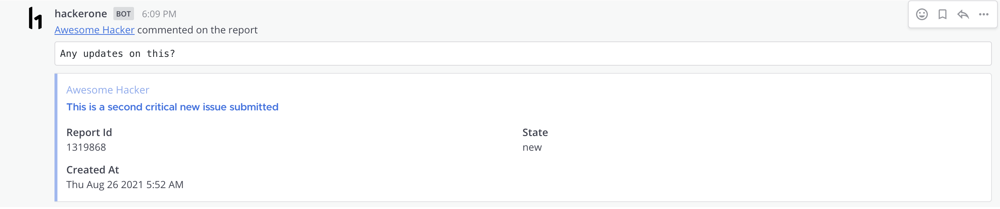
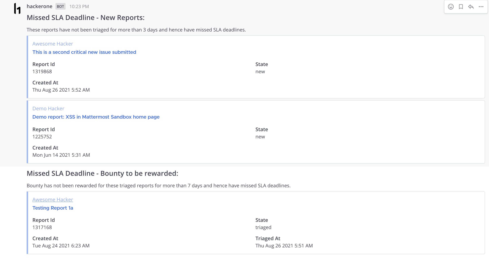

# Mattermost Hackerone Plugin

**Maintainer**: [@srkgupta](https://github.com/srkgupta)

A Hackerone plugin for Mattermost. This plugin allows users to subscribe to Hackerone notifications, stay up-to-date with all the reports submitted on the Hackerone platform, and other common Hackerone actions - directly from Mattermost.

## About

This plugin allows you to perform following actions on Mattermost:

* Fetch reports from Hackerone as per the filter criteria specified.
* Get detailed info about a Hackerone report
* Receive notifications about any new activity on any of your program's Hackerone report.
* Receive notifications when any of your program's report reaches a configured SLA deadline.

Ultimately, this will make you or your team more productive and make the experience with Hackerone much smoother.

### Screenshots

#### Fetch certain reports from Hackerone as per filter criteria

#### Get detailed info about a Hackerone report

#### Receive notifications about any new activity

#### Receive notifications about missed SLA deadlines

### Audience

This guide is for Mattermost System Admins setting up the Hackerone plugin and Mattermost users who want information about the plugin functionality.

### Important notice

* Responses of the slash subcommands `reports` and `report` will be visible to all users on the channel where the slash command was executed
* If you are a Hackerone admin/user and think there is something this plugin lacks or something that it does could be done the other way around, let us know!
We are trying to develop this plugin based on users' needs.
* If there is a certain feature you or your team needs, open up an issue, and explain your needs.
We will be happy to help.

## Installing the plugin

1. Download the latest stable version of the plugin from the [releases page](https://github.com/srkgupta/mattermost-plugin-hackerone/releases)
2. In Mattermost, go to **System Console → Plugins → Management**
3. Upload the plugin in the **Upload Plugin** section
4. Configure the plugin before you enable it :arrow_down:

## Configuring the plugin

1. In Mattermost, go to **System Console → Plugins → Management** and click *Enable* underneath the Hackerone plugin
2. Click on *Settings* underneath the Hackerone plugin and update the Hackerone configurations as mentioned below:
    * **Hackerone Program Handle**
        * Handle of your Hackerone program
    * **Hackerone API Identifier and API Token**
        * Please follow the instructions available at the following page to generate a API Identifier and API Token for your Hackerone Program:
        https://docs.hackerone.com/programs/api-tokens.html
    * **Poll Interval (in seconds)**
        * Interval at which new data will be polled via the Hackerone API. Default: 30 seconds. Minimum: 10 seconds. Max: 3600 seconds.
    * **SLA Poll Interval (in seconds)**
        * Interval at which the plugin will check for missed SLA deadlines. Default: 86400 seconds. 
        * Note: By default, the subscribed channel will get notified every day when there are reports which has missed the SLA deadlines. 
    * **SLA for New Reports (in days)**
        * Define the SLA for the expected timeline (in days) for status to be changed for New reports. For example, if the report is not changed from New state to any other state for more than 3 days, the subscribed channels will be notified as `Missed SLA Deadline - New Reports`
    * **SLA for Bounty (in days)**
        * Define the SLA for the expected timeline (in days) for bounty to be rewarded for Triaged reports. For example, if a triaged report was not rewarded any bounty for more than 7 days, it will be shown under missed deadline reports.
    * **SLA for Triaged Reports (in days)**
        * Define the SLA for the expected timeline (in days) for status to be changed for Triaged reports. For example, if the report is not changed from Triaged to Resolved for more than 15 days, it will be shown under missed deadline reports.

3. Click *Save* to save the settings
4. The plugin is now ready to use! :congratulations:

## Updating the plugin

To update the plugin repeat the [Installing the plugin](https://github.com/srkgupta/mattermost-plugin-hackerone/#installing-the-plugin) step.

## Using the plugin

Interaction with the plugin involves using slash commands.

### Slash commands overview

* `hackerone`
  * `reports <filter>`
  * `report <report_id>`
  * `subscriptions <list|add|delete>`
  * `permissions <list|add|delete>`

### Slash commands documentation

#### hackerone

`hackerone`

This is the root command.

##### reports

`reports <filter>`

This action allows you to get list of reports from Hackerone based on the filter supplied. Example: `/hackerone reports triaged`

**Important Note:** Response of this slash command will be visible to all users on the channel where the slash command was executed.

Following filter options are currently available:

* **new** - Fetches new reports from Hackerone.
* **triaged** - Fetches triaged reports from Hackerone
* **needs-more-info** - Fetches reports which requires more information.
* **bounty** - Fetches reports that is triaged & is awaiting for a bounty to be rewarded.
* **disclosure** - Fetches reports that the researchers have requested for public disclosure
* **disclosed** - Fetches reports that have been disclosed.
* **resolved** - Fetches reports that have been resolved.

##### report

`report <report_id>`

This action allows you to get detailed information about the requested report id.

Example: `/hackerone report 1317168`

**Important Note:** Response of this slash command will be visible to all users on the channel where the slash command was executed.

##### subscriptions

`subscriptions <list|add|delete>`

This action allows you to subscribe the current channel to receive Hackerone notifications. Once a channel is subscribed, the service will:

* poll Hackerone for new activity and publish it on the subscribed channel
* notify the subscribed channel whenever there are reports which has missed the SLA deadlines.

###### subscriptions add

There are 2 ways of running the `subscriptions add` slash command:

**Without a report id** - For example: `/hackerone subscriptions add`

* If the <report_id> is not specified, the service will notify the subscribed channel for any new activities or missed SLA deadlines for all the reports. 

**With a report id** - For example: `/hackerone subscriptions add 1317168`

* If a <report_id> is specified, the service will notify the subscribed channel for any new activities or missed SLA deadlines only for the specified report. This can be extremely useful if you have separate channels created for each Hackerone report. 

###### subscriptions list

This action allows you to list all the channels which has been set to receive all the Hackerone notifications.

###### subscriptions delete [index]

This action allows you to delete the specified subscription and hence that specific channel will stop receiving any notifications for any events from Hackerone. You can run the command `/hackerone subscriptions list` to get the index position. Note: The index position starts with 1.

##### permissions

`permissions <list|add|delete>`

This action allows you to Access Control users who can run hackerone slash commands. Note: By default, all system administrators can run the `/hackerone` slash commands.

###### permissions add @username

This action allows you to whitelist the user and allow them to run the Hackerone slash commands. For example: `/hackerone permissions add @user1`

###### permissions delete @username

This action allows you to delete the whitelisted user and prevent them from running the Hackerone slash commands. For example: `/hackerone permissions delete @user1`.

###### permissions list

This action allows you to list all the users who are allowed to run the Hackerone slash commands. Note: By default, all system administrators can run the `/hackerone` slash commands.

## Contributing

<!-- TODO(amwolff): Write more about contributing to the plugin. Add CONTRIBUTING.md? -->

This repository uses the [mattermost-plugin-starter-template](https://github.com/mattermost/mattermost-plugin-starter-template).
Therefore, developing this plugin is roughly the same as it is with every plugin using the template.
All the necessary steps to develop are in the template's repository.

### Reporting security vulnerabilities

You can report security vulnerabilities to @rohitesh.gupta at the [Community Server](https://community.mattermost.com/).
Please adhere to the [Responsible Disclosure Policy](https://mattermost.com/security-vulnerability-report/).
